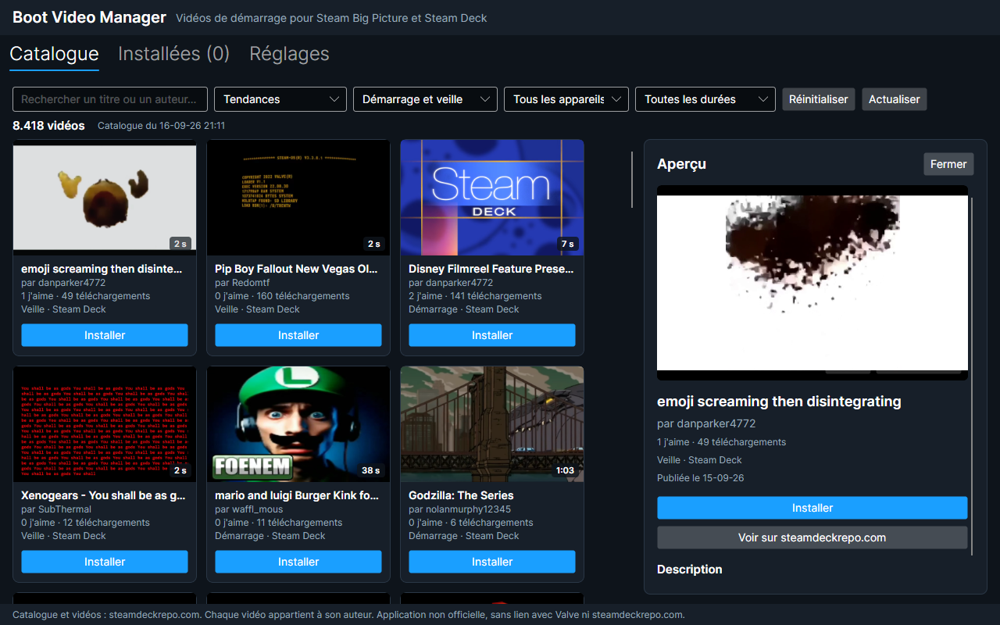
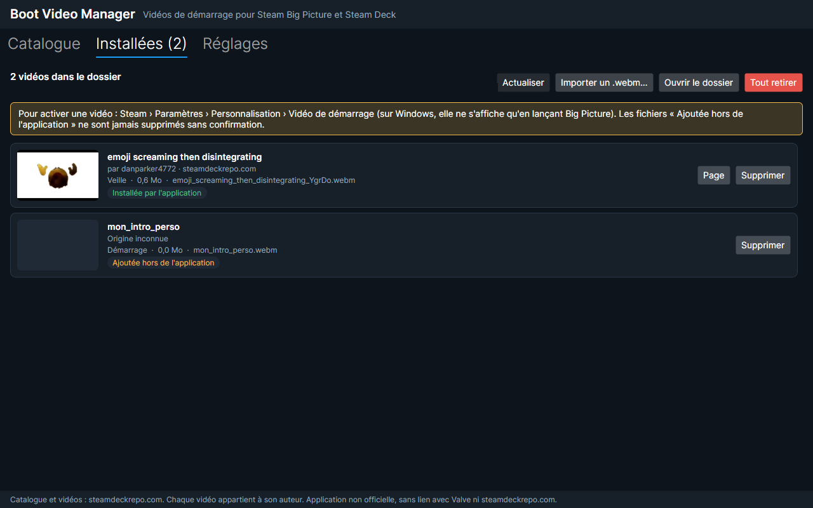

<div align="center">


# Boot Video Manager

**Browse, preview and install custom startup videos for Steam Big Picture and the Steam Deck — in one click.**

[](https://github.com/Robocnop/BootVideoManager/releases/latest)
[](https://github.com/Robocnop/BootVideoManager/actions/workflows/ci.yml)
[](LICENSE)


[**Download**](https://github.com/Robocnop/BootVideoManager/releases/latest) ·
[Features](#features) ·
[How it works](#how-it-works) ·
[Troubleshooting](#troubleshooting) ·
[Building from source](#building-from-source)

</div>

---

Boot Video Manager is a desktop "mod launcher" for Steam **startup movies**. It gives you the whole
[steamdeckrepo.com](https://steamdeckrepo.com/) catalog (about 8,400 videos) with search, filters and a live preview,
installs a video into Steam in one click, and removes it cleanly when you are done — without ever touching files
you did not ask it to.

The interface is available in **English and French**.

> Unofficial project, not affiliated with Valve or steamdeckrepo.com. Every video belongs to its author, who is
> credited on its page.





## Quick start

1. Download **`BootVideoManager-<version>-win-x64-setup.exe`** from the
   [latest release](https://github.com/Robocnop/BootVideoManager/releases/latest)
   (`win-arm64` for ARM PCs such as Snapdragon laptops) and run it. The installer is not code-signed yet, so Windows
   SmartScreen may warn about it: click *More info*, then *Run anyway*.
2. Open Boot Video Manager, pick a video in the **Catalog** and click **Install**.
3. If Steam still plays its own video, the app offers to turn on Steam's **Random startup movie** option for you
   (Steam restarts if it is open): Steam then picks one of your enabled videos at each start.
4. Launch **Big Picture mode** and enjoy.

No administrator rights and no .NET runtime are needed: the installer ships every component and installs for the
current user by default.

## Features

### Catalog

- The **full steamdeckrepo.com catalog** with thumbnail, author, duration, likes, downloads, type and target devices.
- **Instant search** by title or author (accent-insensitive), **sorting** (trending, most downloaded, most liked,
  newest, oldest) and **filters** (startup or suspend video, Steam Deck or Steam Machine, duration).
- A **looping preview** inside the app, with pause, mute and volume.
- Your sort, filters and preview volume are **remembered** between sessions.
- **Works offline** with the last known catalog.
- **Sign in with Steam** (on Steam's own page, the app never sees your password) to **like** videos and show only
  **your likes**; the account appears at the top of the window.

### Safe installation

- Downloads are **verified** (WebM signature, size, SHA-256) before being placed in Steam's
  `config/uioverrides/movies/` folder under a clean, unique name.
- Interrupted downloads **resume where they stopped**; two run at a time and the others wait their turn.
- Every install is tracked: the app **never deletes a file it did not install** (or that was modified since)
  without asking first.
- **Import** your own `.webm` files.

### Installed videos

- One list for everything Steam can play: your videos, **Steam's stock intros** (Steam Deck, Steam Deck OLED,
  Big Picture, SteamOS…) and the videos in **Steam's startup movie cache**.
- **Enable or disable** any video with a switch, without deleting or re-downloading it — disabled videos are simply
  moved to a folder Steam ignores, so they also leave the shuffle.
- Steam's original files and Points Shop items are **never modified**.
- **Makes Steam actually play them**: a fresh Steam keeps playing its own video until *Random startup movie* is turned
  on. The app detects it, offers to turn it on (closing and restarting Steam if needed) and keeps a copy of Steam's
  `config.vdf` as `config.vdf.bvm-backup`. Only that one setting is changed.

### Share your selection

- **Share › Export my videos** saves your catalog videos (and the Steam stock intros you enabled) in a small
  `.bvmpack` file, with each video's enabled or disabled state.
- Your friends use **Share › Import a pack**: the app shows what will happen, downloads the missing videos from
  steamdeckrepo.com and applies the same states. It can also disable their other videos so Steam only plays the
  pack's — nothing is ever deleted.
- A pack only holds references, never video files: videos you imported from your own `.webm` files are not included.

### App

- **Automatic updates**: the app checks GitHub at startup and installs a new version in one click. The installer is
  verified against the size and SHA-256 published with the release before it runs; the app then restarts, up to
  date. You can skip a version or turn the check off.
- **Automatic Steam detection** (Windows registry, `~/.steam`, `~/.local/share/Steam`, Flatpak, Snap), or pick the
  folder yourself.
- **Single instance**: launching the app again brings the open window to the front.
- **Diagnostic log**, one click away in *Settings › About*, to attach to bug reports.

## How it works

Steam plays any `.webm` placed in `<Steam>/config/uioverrides/movies/` and lists it under
*Settings › Customization*. Boot Video Manager manages that folder for you:

| Location | Used for |
|---|---|
| `config/uioverrides/movies/` | Videos Steam can play (installed by the app, imported, or added by hand) |
| `config/uioverrides/movies_disabled/` | Videos you disabled — kept, but invisible to Steam |
| `steamui/movies/` | Steam's stock animations — read only; enabling one copies it to `movies/` as `steam_default_*.webm` |
| `config/communityitemscache/startupmovies/` | Steam's own startup movie cache, also used by the shuffle |

The app's own data never goes inside the Steam folder:

| | Windows | Linux |
|---|---|---|
| Settings and install manifest | `%APPDATA%\BootVideoManager\` | `~/.config/BootVideoManager/` |
| Cache (catalog, thumbnails, updates) | `%LOCALAPPDATA%\BootVideoManager\cache\` | `~/.cache/BootVideoManager/` |
| Logs (kept 14 days) | `%LOCALAPPDATA%\BootVideoManager\logs\` | `~/.local/state/BootVideoManager/logs/` |

The cache can be deleted at any time. If the manifest is deleted, installed videos stay in place and simply ask
for confirmation before deletion.

### Being a good citizen

steamdeckrepo.com is a community site, so the app keeps its footprint small: the full catalog is fetched once and
cached for an hour, then refreshed with conditional requests (`If-Modified-Since` → empty `304`); search, sorting and
filtering happen locally; thumbnails are cached on disk with at most four parallel downloads; requests carry an
identifiable User-Agent, honour `Retry-After` and are retried at most three times; videos are downloaded through the
site's official `/post/download/{id}` link.

## Download options

| File | For |
|---|---|
| `BootVideoManager-<version>-win-x64-setup.exe` | **Windows 10/11 — recommended** |
| `BootVideoManager-<version>-win-arm64-setup.exe` | Windows on ARM |
| `BootVideoManager-<version>-win-x64-portable.exe` | Windows, no installation (single file) |
| `BootVideoManager-<version>-win-arm64-portable.exe` | Windows on ARM, no installation |
| `BootVideoManager-<version>-x86_64.flatpak` | **Linux / Steam Deck — recommended** (updates itself afterwards) |
| `BootVideoManager.flatpakref` | Linux: same app, installed straight from the update repository |
| `BootVideoManager-<version>-linux-x64.tar.gz` | Linux x64, no installation (advanced) |
| `SHA256SUMS.txt` | Checksums of every file |

- The **installer** adds Start menu (and optional desktop) shortcuts and an entry in *Settings › Apps*. It can
  install for the current user (default, no admin prompt) or for all users. Updates install over the existing
  copy; uninstalling offers to remove settings and cache and never touches the videos placed in Steam.
- The **portable** executable contains everything; its native libraries are extracted to `%TEMP%\.net` on first
  launch. It tells you when a new version is out but cannot replace itself: the button opens the download page.
- **Linux / Steam Deck (desktop mode)**: open [robocnop.github.io/BootVideoManager](https://robocnop.github.io/BootVideoManager/)
  and click *Install*, or download the `.flatpak` file from a release and open it. Your software center (Linux Mint's
  Software Manager, Discover, GNOME Software…) installs it with everything included (video previews, Steam sign-in),
  then **updates it with every release**, like any other app. From a terminal:
  `flatpak install --user https://robocnop.github.io/BootVideoManager/io.github.Robocnop.BootVideoManager.flatpakref`.
  If Steam itself is the Flatpak version, pick its folder (`~/.var/app/com.valvesoftware.Steam/.local/share/Steam`)
  with *Settings › Choose a folder…*.
- The **Linux archive** needs VLC from your package manager for previews: extract it, then
  `chmod +x BootVideoManager && ./BootVideoManager`.

## Troubleshooting

**Windows SmartScreen warns about the installer.**
The executable is not code-signed yet. Click *More info*, then *Run anyway*.

**The video does not play when Steam starts.**
On Windows, Steam only plays the startup movie when **Big Picture mode** starts. Also check that the video is enabled
in the app's *Installed* tab and that *Random startup movie* is on in *Steam › Settings › Customization* (the
*Installed* tab shows a banner with a **Turn on** button when it is off).

**Steam is stuck on a black screen.**
Disable or delete the video from the *Installed* tab, then restart Steam.

**Steam was not found.**
Open *Settings* in the app and choose your Steam folder (the one that contains `config` and `steamapps`).

**Something else went wrong.**
Open *Settings › About › Open the logs folder* and attach today's log to a
[new issue](https://github.com/Robocnop/BootVideoManager/issues).

## Building from source

Requirements: the [.NET 10 SDK](https://dotnet.microsoft.com/download) (pinned by `global.json`), and
[Inno Setup 6](https://jrsoftware.org/isinfo.php) for the Windows installer (`winget install JRSoftware.InnoSetup`).

```bash
dotnet build BootVideoManager.slnx
dotnet run --project src/BootVideoManager.App
dotnet test --solution BootVideoManager.slnx
```

To try the app without touching your real Steam install, create a folder containing a `config` sub-folder and run:

```bash
dotnet run --project src/BootVideoManager.App -- --steam-root /path/to/FakeSteam
```

Self-contained builds (tests first, then publish to `artifacts/publish/`):

```powershell
./build/publish.ps1                            # win-x64 (installer + portable) and linux-x64
./build/publish.ps1 -Runtime win-x64,win-arm64
./build/publish.ps1 -SkipInstaller             # without Inno Setup
```

```bash
./build/publish.sh linux-x64                   # on Linux (keeps the executable bit)
./packaging/linux/build-appimage.sh            # AppImage, requires appimagetool
```

### Releasing

1. Bump `<Version>` in `Directory.Build.props`.
2. Optionally write the release notes in `docs/release-notes/v<version>.md`.
3. Push a matching tag: `git tag v1.2.0 && git push origin v1.2.0`.

[`release.yml`](.github/workflows/release.yml) then runs the tests, builds the x64 and ARM64 installers and portable
executables plus the Linux archive, and publishes them with `SHA256SUMS.txt` — which the in-app updater requires.
Tags with a suffix (`v1.2.0-beta`) become pre-releases, which the app never offers.

### Project layout

```
src/BootVideoManager.Core          UI-independent services, fully unit tested
  Api/            steamdeckrepo.com client, tolerant parser, polite retries
  Catalog/        disk cache, conditional refresh, search / filters / sorting
  Install/        verified and resumable downloads, manifest, safe removal
  Updates/        GitHub release check, verified installer download
  Steam/          Steam installation detection
  Caching/        thumbnail cache
  Localization/   French / English
  Platform/       app folders, settings, log
src/BootVideoManager.App           Avalonia 12 + CommunityToolkit.Mvvm (Views, ViewModels, Services, Controls)
tests/BootVideoManager.Core.Tests  xUnit v3
tests/BootVideoManager.App.Tests   headless Avalonia UI tests
packaging/windows                  Inno Setup script (silent update mode: /UPDATE=1)
packaging/linux                    AppImage script and desktop entry
packaging/flatpak                  Flatpak / Flathub manifest (see its README)
```

Design notes: [docs/architecture.md](docs/architecture.md) · API and Steam paths research:
[docs/research.md](docs/research.md).

## Known limitations

- **Tested mostly on Windows 11.** The Linux build runs on Linux Mint; it has not been tried on a real Steam Deck yet.
- **No OLED / LCD filter**: steamdeckrepo.com does not provide that information.
- **Linux archive previews** depend on the system libvlc (the Flatpak bundles its own).
- **Controller use**: keyboard navigation, visible focus and infinite scrolling work, but there is no dedicated
  Game Mode interface yet.
- Suspend animations install like startup videos; selecting them as the resume animation has not been verified on a
  Deck.

## Contributing

Bug reports, ideas, translations and pull requests are welcome — see [CONTRIBUTING.md](CONTRIBUTING.md) for the
setup, the project rules and how to report a bug with the app's log.

## License

[MIT](LICENSE). Videos from the catalog remain the property of their authors.

## Credits

- Catalog, thumbnails and videos: [steamdeckrepo.com](https://steamdeckrepo.com/) and its creators.
- Inspiration: [steam-deck-repo-manager](https://github.com/waylaidwanderer/steam-deck-repo-manager) and
  CapitaineJSparrow's original Steam Repo Manager.
- Built with [Avalonia](https://avaloniaui.net/), [CommunityToolkit.Mvvm](https://github.com/CommunityToolkit/dotnet),
  [LibVLCSharp](https://github.com/videolan/libvlcsharp) and
  [System.IO.Abstractions](https://github.com/TestableIO/System.IO.Abstractions).
